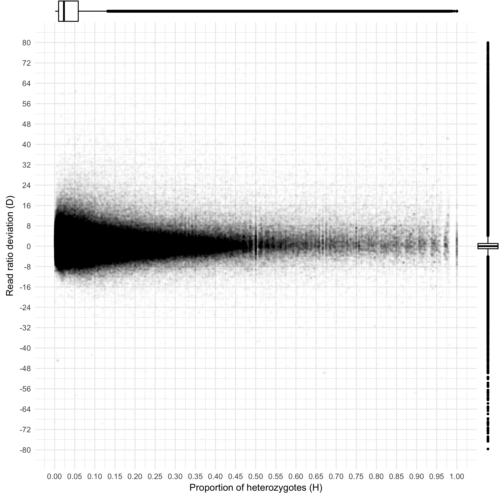
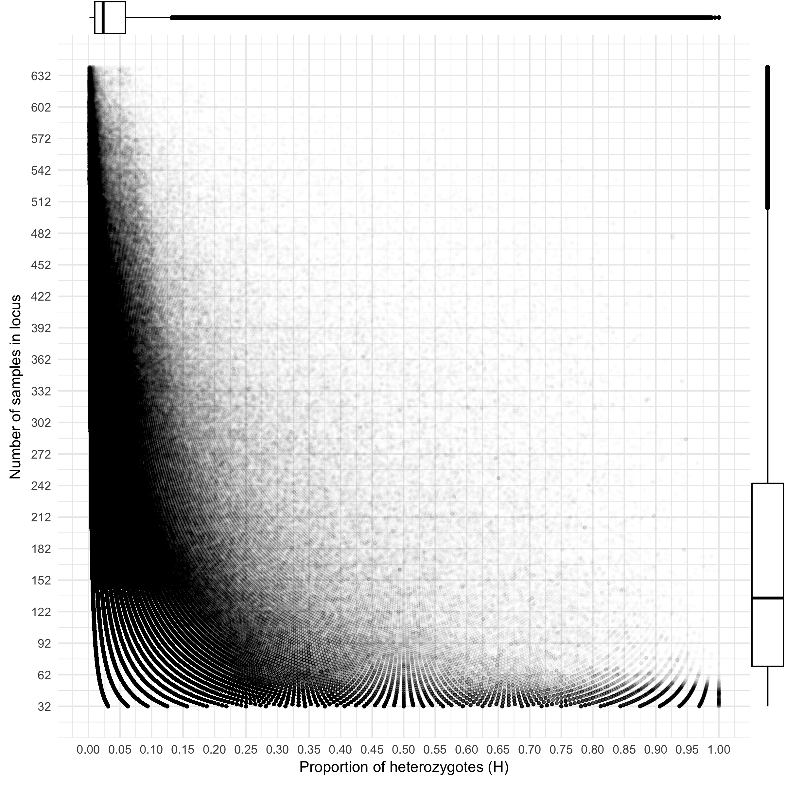
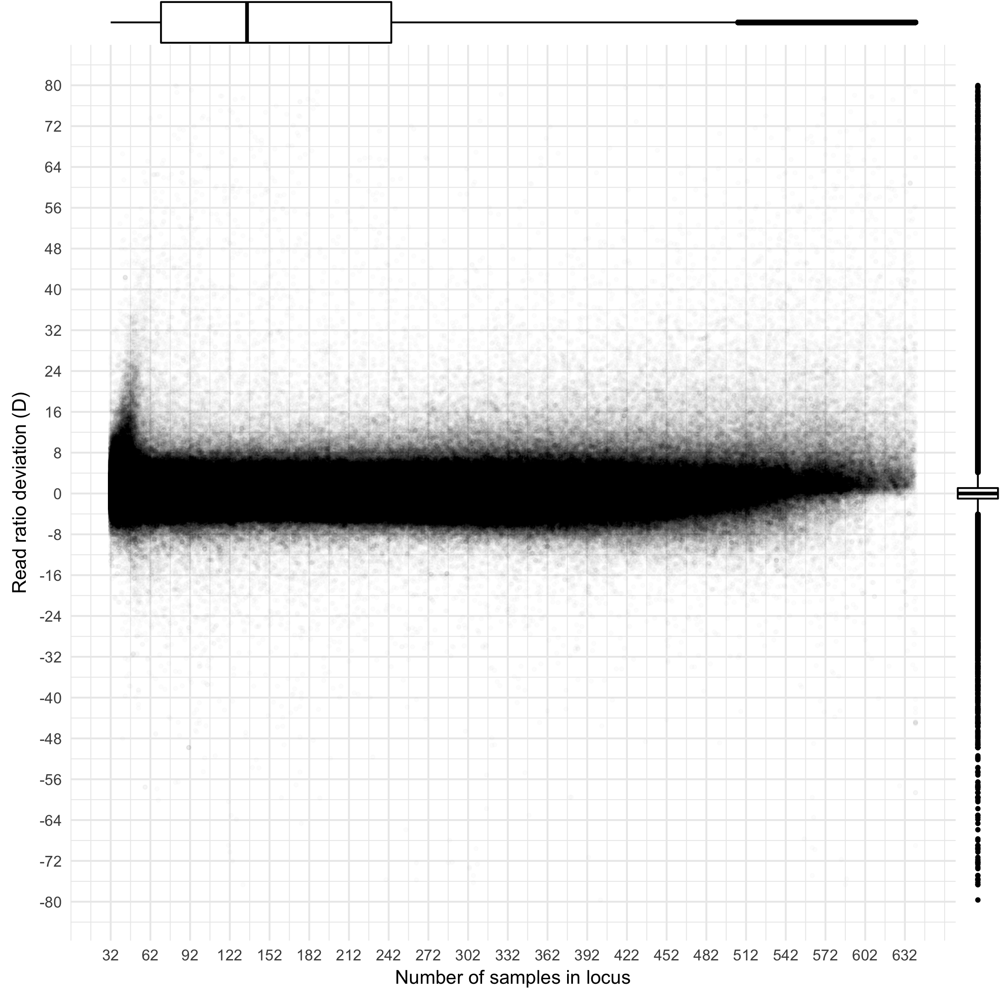
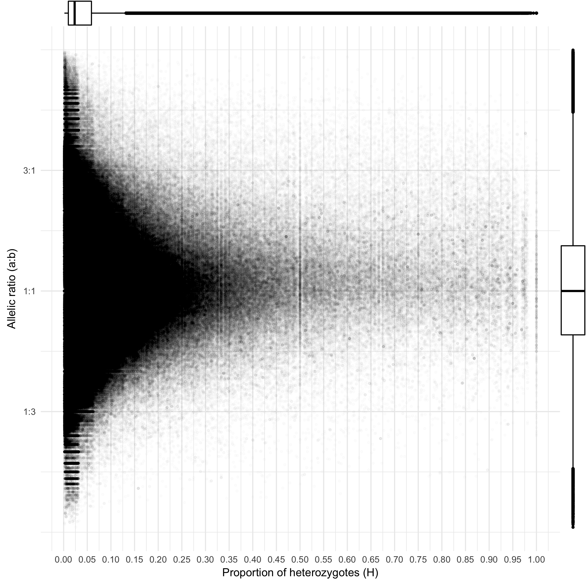

# paralog-finder
Detects and blacklists paralog RAD loci analyzed in Stacks, based on the McKinney 2017 method (doi:10.1111/1755-0998.12613)

## _Description_
These scripts allow the identification of paralog RAD loci based on the method of McKinney _et al._ 2017 (doi:10.1111/1755-0998.12613). However, we introduced some modifications and also made some additions. The main modification we made is the way in which the percentage of heterozygote individuals is calculated in datasets with varying degrees of missing data per locus. McKinney _et al._ (2017) divide the number of heterozygote individuals in the locus over the total number of individuals in the dataset, their results were not skewed because they either simulated data (0% missing data) or use very stringent filters for empirical data (at most 10% missing data per locus). Instead, our calculations consider only the number of individuals present at each locus since typical datasets usually have many loci represented by just a few individuals.

As an addition to their method, we also provide a script that creates a blacklist of paralog loci that can be used in `Stacks` to run the `populations` module and exclude the paralogs from the calculations and the output matrices for downstream analyses with other software.

Briefly, the scripts must be run in three steps:
- **Step 1:** Calculate loci statistics from the VCF file produced by Stacks with the script `HDplot_process_vcf.py`
- **Step 2:** Plot the statistics and decide limits for maximum heterozigosity (H), maximum and minimum read ratio deviation (D), and minimum of samples per locus with the R script `HDplot_graphs.R`
- **Step 3:** Provide the parameters decided by the inspection of the graphs to the script `blacklist_paralogs.py` to create the blacklist of paralog loci and a whitelist of singleton loci.

## _Requirements_
- Python 2.7 with the packages: `scipy`, `pandas`, `numpy`, and `statsmodels`, these are easy to install if you use [`miniconda`](https://conda.io/miniconda.html).
- R with the CRAN packages: `ggplot2`, `ggExtra`, and `argparse`.

## _Usage_
### Step 1: HDplot_process_vcf.py
The script calculates heterozigosity and read ratio deviation from a VCF file produced by `Stacks`. Type `python HDplot_process_vcf.py -h` to show the help message:
```
usage: HDplot_process_vcf.py [-h] -i FILENAME

Processes a VCF input file produced by Stacks for plotting heterozigosity and
read depth deviations using the method of McKinney et al. 2017 (doi:
10.1111/1755-0998.12613)

optional arguments:
  -h, --help            show this help message and exit
  -i FILENAME, --input FILENAME
                        Name of VCF input file, must have read depth per
                        allele in each individual (Stacks format)
```
_Example:_ This command creates a file with the same name as the VCF but with extension .depthsBias: `batch_1.depthsBias`
```bash
python HDplot_process_vcf.py -i batch_1.vcf
```

### Step 2: HDplot_graphs.R
The script plots the loci information contained in the `.depthsBias` file produced by Step 1. Ttype `Rscript HDplot_graphs.R -h` to show the help:
```
usage: HDplot_graphs.R [-h] -i INPUT [--minD MIND] [--maxD MAXD]
                       [--transp TRANSP]

optional arguments:
  -h, --help            show this help message and exit
  -i INPUT, --input INPUT
                        Name of the file with extension .depthsBias
  --minD MIND           Minimum D to display in graph, default = min from data
  --maxD MAXD           Maximum D to display in graph, default = max from data
  --transp TRANSP       Transparency for points in graph, default = 0.01
```
_Example:_ To create the graphs displaying a range for D between -80 and 80:
```bash
Rscript HDplot_graphs.R -i batch_1.depthsBias --minD -80 maxD 80
```
This command will produce four graphs:  
**graph1_D_vs_Het.png:** The graph shows the read ratio deviation plotted against percentage of heterozygotes in the locus (in this case a single SNP). Since the cloud of points can be misleading when plotting data from millions of SNPs we also added marginal boxplots to all graphs. According to this plot we would pick limits for **D between  -4 and -4** to retain ~95% of the SNPs.  

**graph2_NumSamplesInLocus_vs_Het.png:**  We added this graph to show how the pecentage of heterozygotes varies according to the locus depth (individuals sharing the locus). The plot shows for example, that loci that have depths of 60 samples or less have excess of heterozigosity. We can also see the peak of heterozigosity at ~0.03 (with 50% of the data between 0.01 and 0.07) that agrees with what is known of the biology of this species (a mostly selfer grass).  

**graph3_D_vs_NumSamplesInLocus.png:** Following the same idea, this graph shows how the D ratio behaves across the variation in locus depth. We can see that loci with 32-62 samples seem to have a bias towards a large positive D. The graph also confirms our putative limits for D between -4 and 4 by looking at the vertical boxplot on the right.    

**graph4_AlleleRatio_vs_Het.png:**  In this case the cloud of points is definitely misleading, we can see that most of SNPs have a 1:1 allelic ratio by looking at the vertical boxplot.  


### Step 3: blacklist_paralogs.py
Based on the parameters we defined from the graphs we can now use this script to create a blacklist of paralogs. The blacklist can be used in `Stacks` to exclude these loci from analysis. Type `python blacklist_paralogs.py -h` for help:
```
usage: blacklist_paralogs.py [-h] -i FILENAME [--maxH MAX_HETPERC]
                             [--minN MIN_NUM_SAMPLES] [--minD MIN_Z]
                             [--maxD MAX_Z]

Creates blacklist of paralog loci (and whitelist of singletons) based on the
method McKinney et al. 2017 (doi: 10.1111/1755-0998.12613)

optional arguments:
  -h, --help            show this help message and exit
  -i FILENAME, --input FILENAME
                        Name of the input file, the table with extension
                        .depthsBias produced by HDplot.py
  --maxH MAX_HETPERC    Maximum proportion of heterozygotes in a locus,
                        default=0.6 taken from McKinney et al. 2017
  --minN MIN_NUM_SAMPLES
                        Minimum number of samples in locus, default=1
  --minD MIN_Z          Lower limit of read ratio deviation (D), default=-7
                        taken from McKinney et al. 2017
  --maxD MAX_Z          Upper limit of read ratio deviation (D), default=7
                        taken from McKinney et al. 2017
```
_Example:_ Assume that loci with D between -4 and 4, and with a heterozigosity of at most 0.06 are singletons:
```bash
python blacklist_paralogs.py -i batch_1.depthsBias --maxH 0.06 --minD -4 --maxD 4
```
And the script will create the blacklist (and a whitelist of singletons) and show some information during execution:
```
Retaining loci with at least 1 sample and with proportion of heterozygotes ≤ 0.06 and D between -4 and 4
249575 loci written to blacklist of paralogs
105403 loci written to whitelist of singletons
```

## _Credits_
- Code: [Edgardo M. Ortiz](mailto:e.ortiz.v@gmail.com)
- Data and testing: [Juan D. Palacio-Mejía](mailto:jdpalacio@gmail.com)
